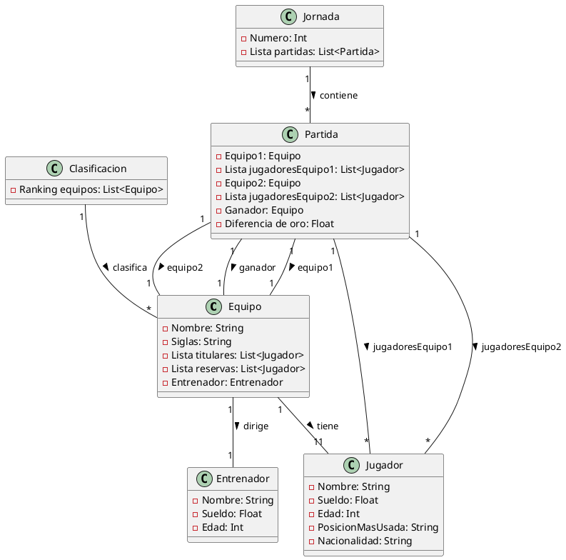

# ESports LOL

## Clases

### Equipo
- Nombre
- Tag
- Lista titulares
- Lista reservas
- Entrenador
### Jugador
- Nombre
- Apellido
- Nickname
- Edad
- Rol
- Nacionalidad
### Entrenador
- Nombre
- Apellido
- Edad
### Jornada
- Numero
- Lista partidas
### Clasificacion
- Ranking equipos
### Partida
- Equipo1
- Lista jugadoresEquipo1
- Equipo2
- Lista jugadoresEquipo2
- Ganador
- Diferencia de oro
### Playoffs

